# Лабораторная работа по git
## На оценку 3

1. Использовал git status, чтобы узнать, на какой ветке нахожусь.
2. Вывел git log?
3. Создал файл sort.c и вставил туда код функции сортировки
4. Вывел git status
5. Добавил файл в область stage (add)
6. Вывел git status
7. Закоммитил файл в репозиторий
8. Вывел git status
9. Добавить комментарий "Файл, предназначен для сортировки целых чисел по возрастанию"
10. Вывел git status
### 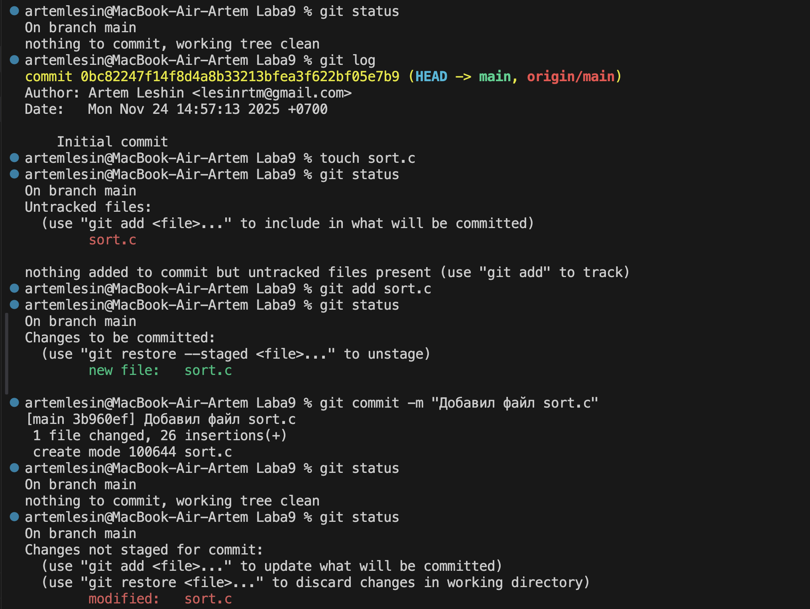

11. Добавил (add) изменение файла
12. Вывел git status
13. Изменил файл еще раз, удалил лишние комментарии
14. Сделал коммит
15. Вывел git status,log
### 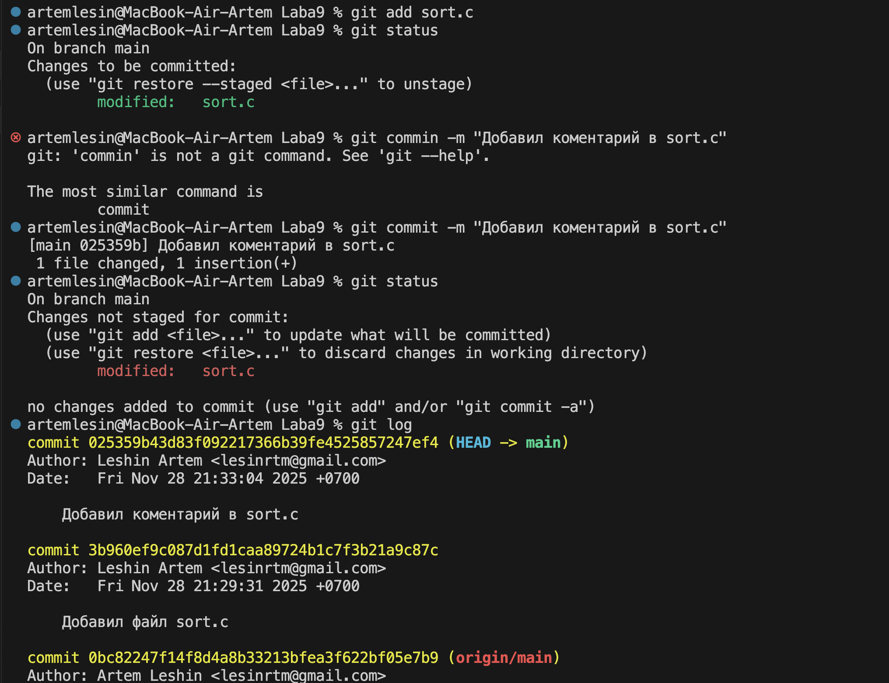

16. Добавил в stage и закомитил последнее изменение
17. Запушил на удаленный репо (git push)
### 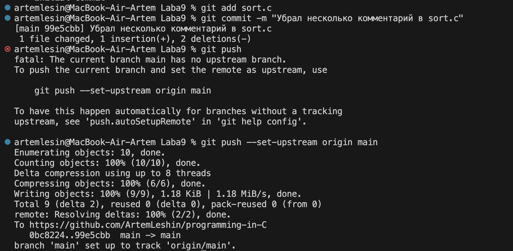
## "Игра с ветками" (ветка mybranch)
1. Используем git branch mybranch (или git checkout -b mybranch), чтобы
создать новую ветку с именем mybranch.
2. Снова используем git branch, чтобы увидеть новую созданную ветку.
3. Используем git switch mybranch (или git checkout mybranch), чтобы
переключиться на новую ветку.
4. Посмотрим как изменяется вывод git status при переключении между master и новой веткой, которую мы создали
5. Убедимся, что находимся на своей ветке mybranch, прежде чем продолжить.
6. Создадим файл с именем file1.txt и своим именем.
7. Добавим файл и закоммитим это изменение.
8. Используем git log --oneline --graph, чтобы увидеть, что ваша ветка указывает на новый коммит.
9. Вернемся к ветке с именем master.
### 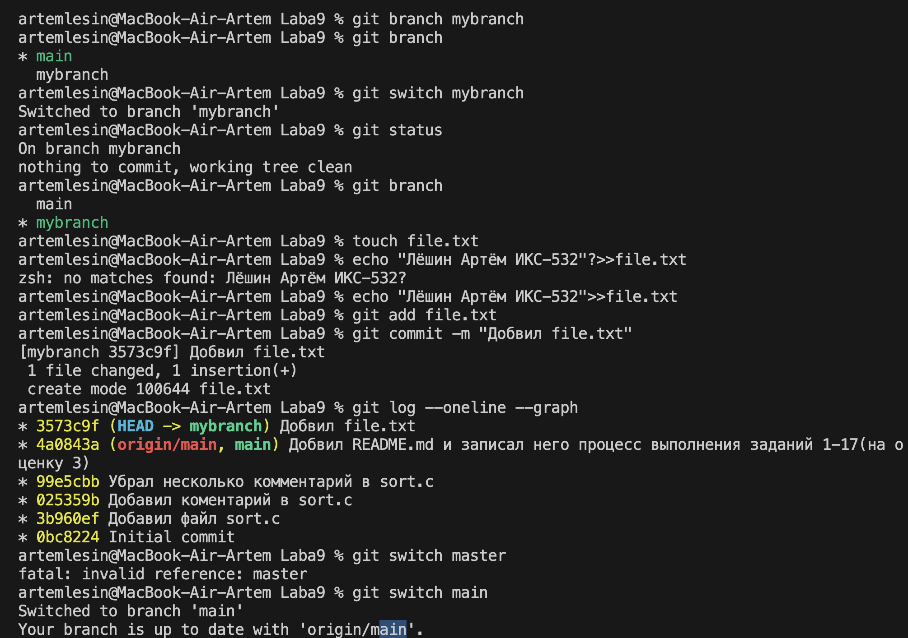

10. Используем git log --oneline --graph, чтобы посмотреть что изменилось
11. Создадим новый файл с именем file2.txt и закоммитим его.
12. Используем git log --oneline --graph --all, чтобы увидеть, что наша ветка
указывает на новый коммит, и что теперь у двух веток разные коммиты.
13. Переключимся на нашу ветку mybranch.
### 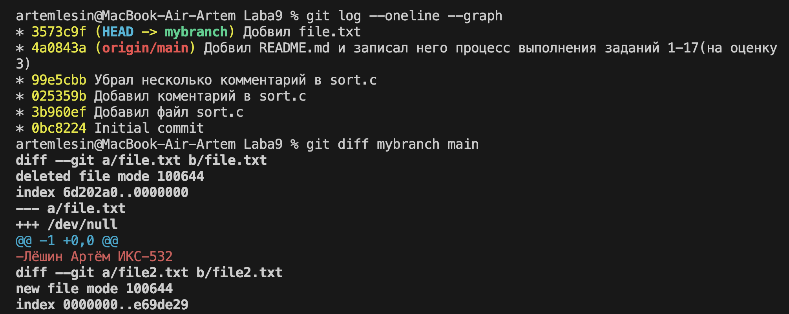

14. Увидим, что file2.txt пропал
15. Используем git diff mybranch master, чтобы увидеть разницу между двумя ветками.
16. Добавим текстовый документ со скриншотами в ветку mybranch. Закоммитим и запушим на удаленный репо ветку mybranch (git push -u origin mybranch)
17. Убедимся, что в github.com две ветки master и mybranch. Не забудем запушить изменения master ветки в master
### 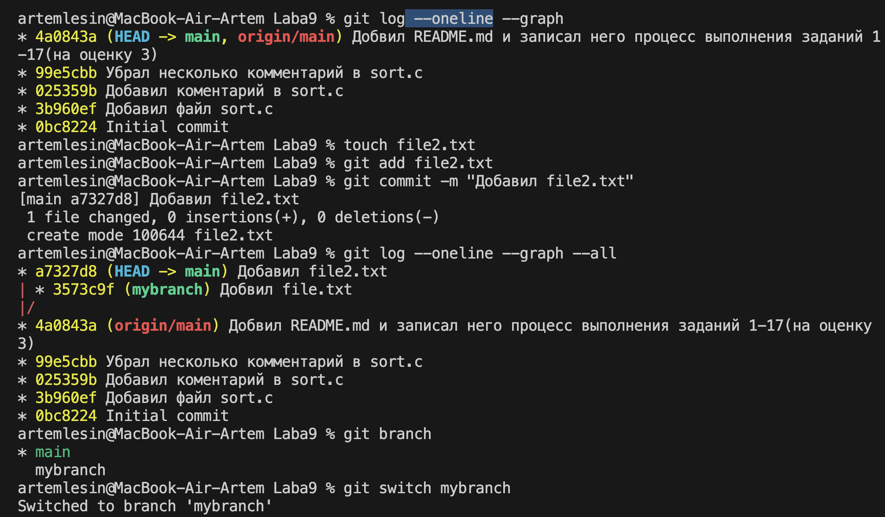

## На оценку 4(Ветка mybranch)
1. Переключимся на ветку mybranch. В ней будет файл sort.c из
предыдущих шагов с функцией сортировки
2. Перезапишим содержимое в sort.c добавив функцию main(), в которой
будет объявлен массив из нескольких чисел (int numbers[] = {5, 2, 8, 1,9}) и
вызвана функция сортировки для этого массива.
3. git diff показывает изменение в sort.c, а именно показывает функцию main()?
### 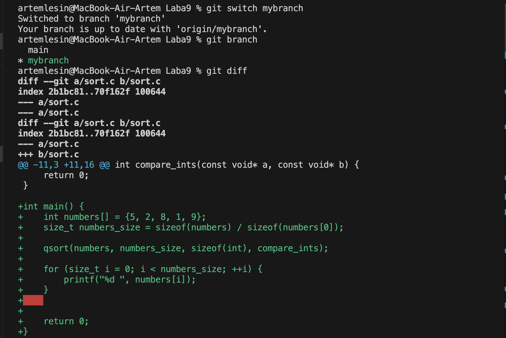

4. git diff --staged - является пустым т.к изменения еще не были добавлены в staged
5. Добавим в staged файл sort.c
6. Теперь git diff будет пустым т.к изменения уже а staged
7. git diff --staged покажет изменения как в пункте 3
### 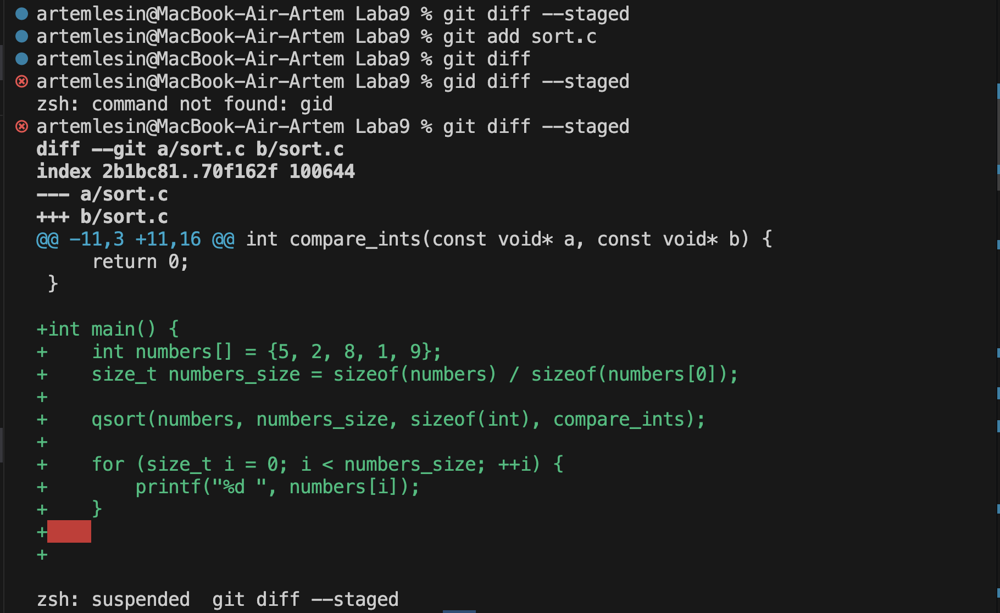

8. Удалил (9) из чисел в массиве в sort.c:
9. git diff показывает удаление числа из массива
10. git diff --staged покажет первоначальное изменение тоесть добавление main()
11. git diff-показывает последнее изменение.
git diff --staged - показывает изменения добавленные в staged
### 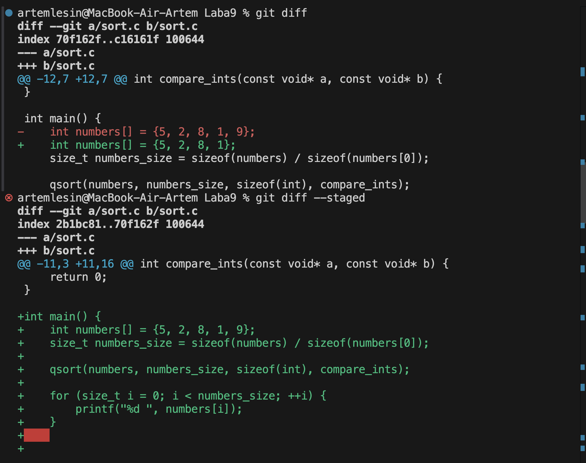

12. Запустим git status, увидим, что sort.c присутствует дважды в выводе.
13. Запустите git restore --staged sort.c, чтобы отменить индексацию изменения
14. git status покажет теперь только последний результат
15. Индексируем изменение (add) и сделаем коммит
### 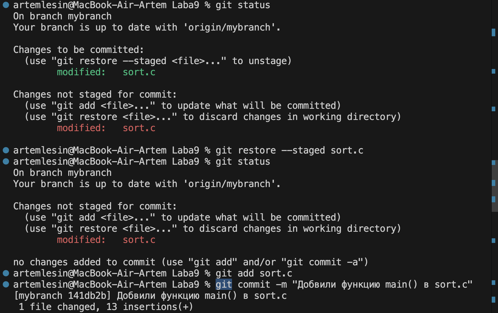

16. Выведем журнал
### 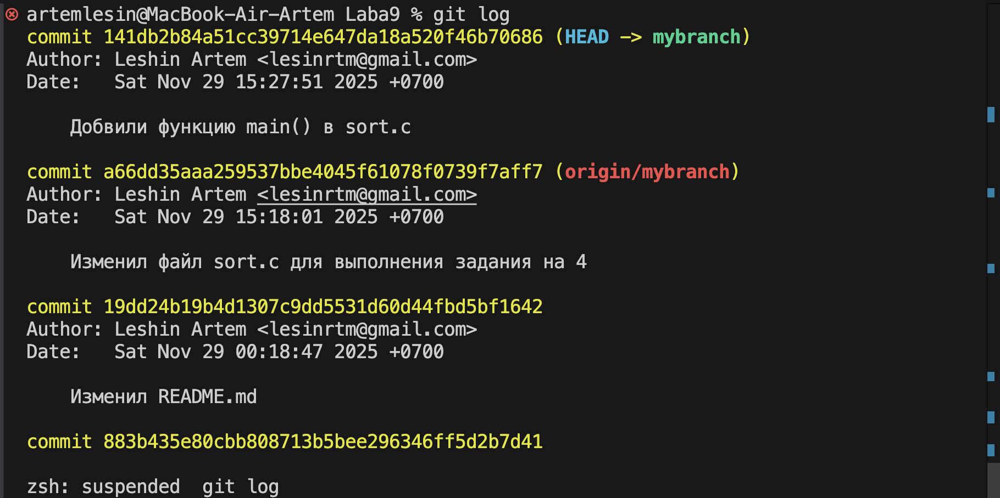

17. Добавил в sort.c в main() printf(“hello git\n”);.
18. содержимое sort.c показывает printf(“hello git\n”);.
19. git status покажет, что sort.c изменен
### 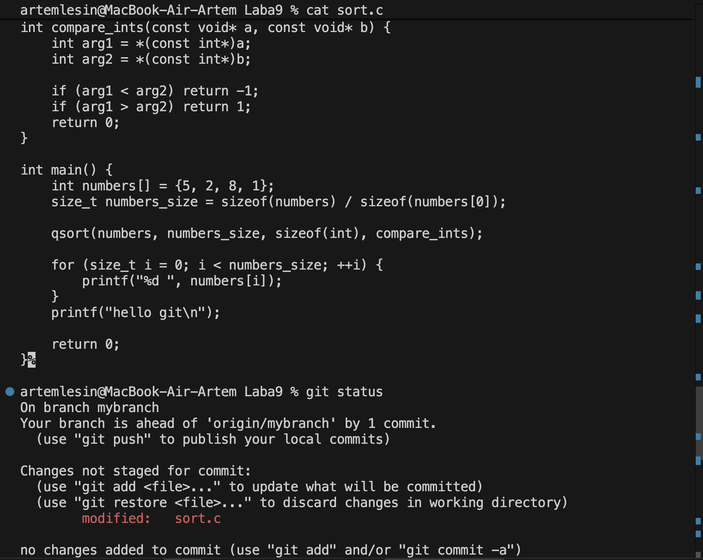

20. Запустим git restore sort.c
21.Увидим, что из содержимого sort.c пропал printf(“hello git\n”);.
22. git status покажет чистый каталог
23. Запушим на удаленный репо ветку.
### 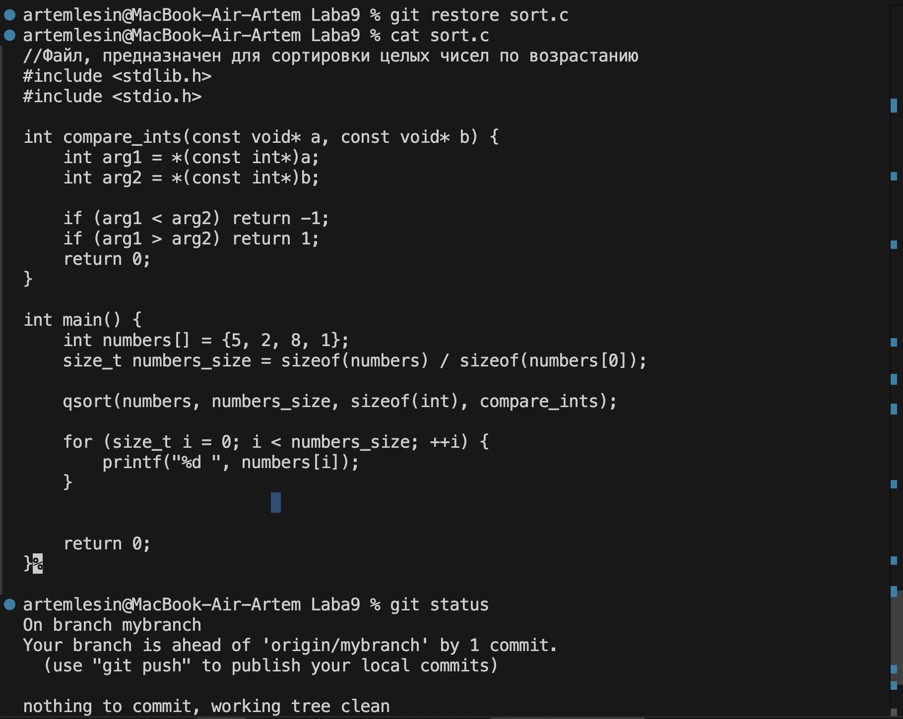

## Теперь поиграемся с ветками и ff-merge
1. Создал файл greeting.txt, проиндексировал и закоммитил с
сообщением “Add file greeting.txt”.
2. Добавил в этот файл слово hello, индексируем и коммитим с текстом
"Add content to greeting.txt"
3. Создал ветку с именем feature/uppercase 
4. Переключился на эту ветку
5. git status говорит нахожусб в ветке feature/uppercase, чистая рабочая директория
6. Отредактировал greeting.txt, чтобы он содержал приветствие в верхнем
регистре (HELLO)
7. Добавил файл greeting.txt и закоммитил
8. git branch указывает на ветку в которой я нахожусь(feature/uppercase)
### 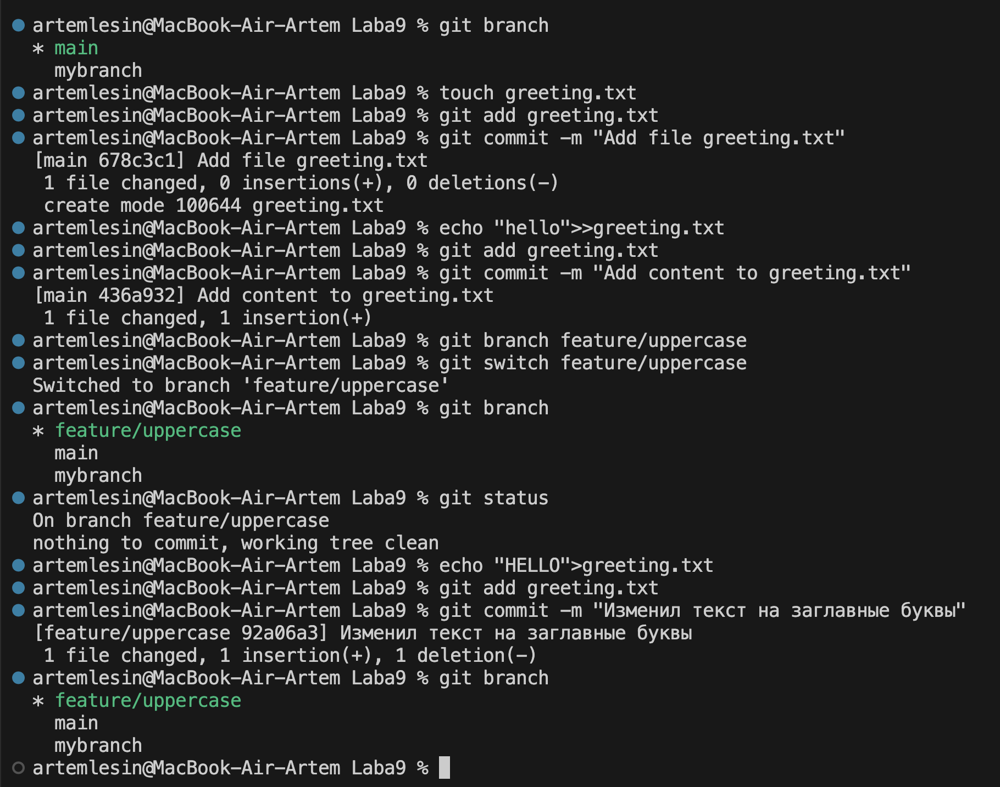

9. git log --oneline --graph –all показывает структуру всех веток и их историю
10. Переключился на главную ветку
11. Использовал cat, чтобы увидеть содержимое файла greetings.txt(hello)
### 
12. Сравним ветки. отличие в регистрах
13. Объединим ветки
14. Используем cat, чтобы увидеть содержимое файла greetings.txt (HELLO)
15. Удалим ветку с заглавными буквами (feature/uppercase)
16. Смержим ветку mybranch в master (git merge), изначально случися конфликт, после исправление смержилось.
### 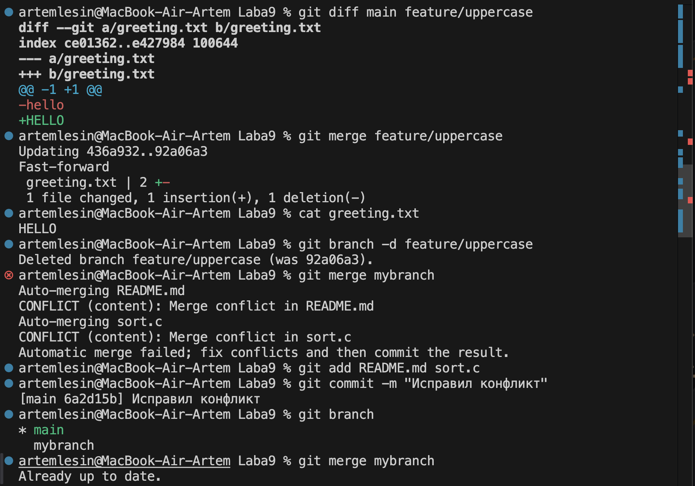

17. git log --oneline --graph --all покажет объединенную историю всех веток.
### 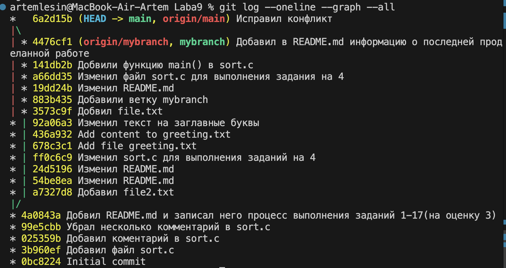

18. Запушим изменения ветки master на удаленный репо.
19. Запушим документ с результатами нашей работы