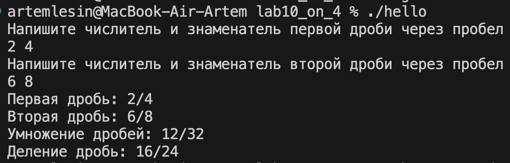

# Практическое задание № 10 Структуры данных на оценку 5
## Вариант 16
### Создайте структуру Дробь с элементами a – числитель, b – знаменатель. Даны две дроби. Реализуйте с этими дробями арифметические действия: умножение и деление (можно написать функции, реализующие эти действия).

#### Выполнение:
#### 