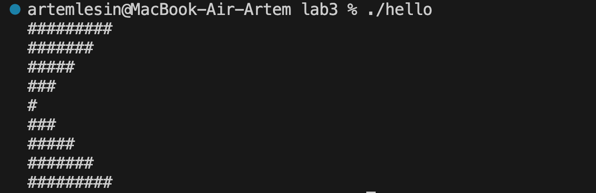

# Практическое задание 3. Вложенные циклы
## Разработать программу для вывода последовательности символов согласно заданию используя вложенные циклы (циклы в циклах). Высота фигуры должна регулироваться.
## 