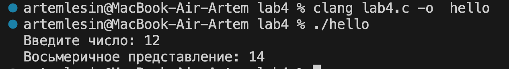

# Практическое задание №4 Битовые операции
## Пусть имеется целое число a > 0. Вывести восьмеричное представление данного числа, используя следующее правило: двоичное представление числа a разбивается справа налево на триады (тройки цифр), и каждая триада заменяется восьмеричной цифрой.
### 