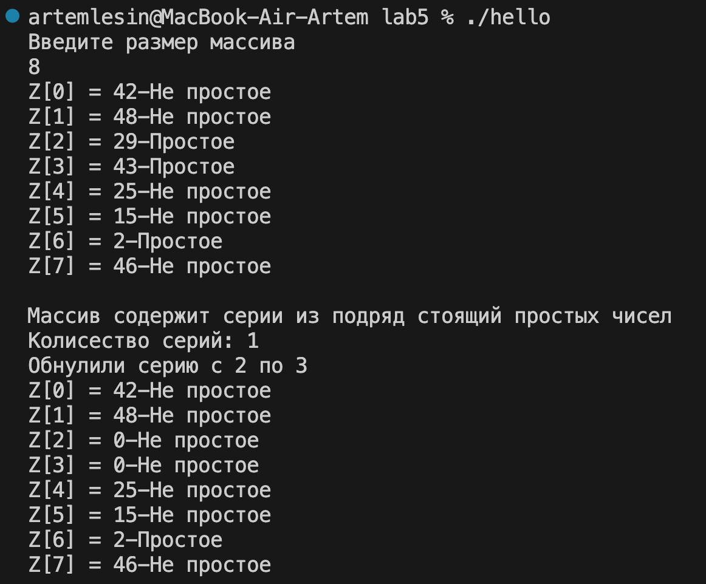

# Практическое задание №5. Обработка одномерных массивов.
## Задан массив Z(m) целых чисел. Определить, содержит ли массив серии из подряд стоящих простых чисел. Если да, то посчитать количество таких серий. Присвоить нулю последнюю такую серию.
### 