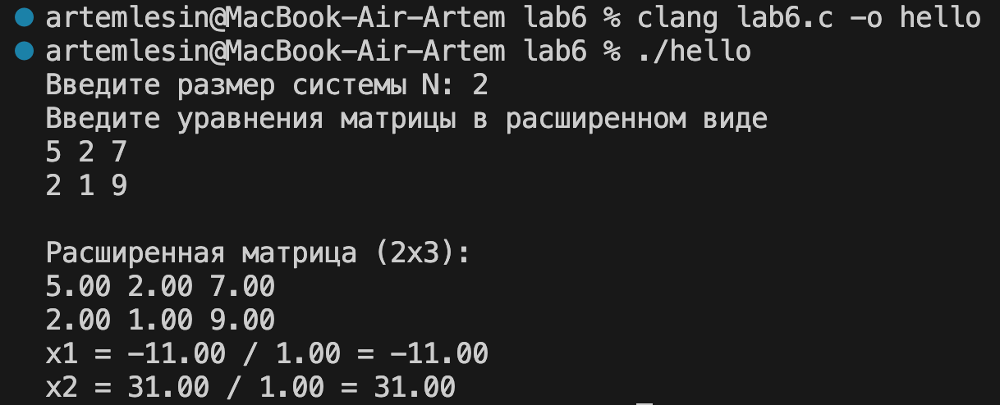
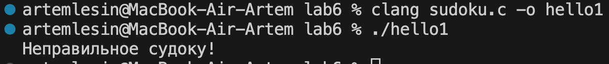

# Практическое задание № 6 Матрицы.
## Реализовать алгоритм Крамера для решения СЛАУ NxN, где N может быть любым.
### 
## Под Звездочкой (+ балл):
## Реализовать программу, что реализует проверку является ли заполненная матрица 9x9 решением судоку. Например, дана матрица 9x9:
### 