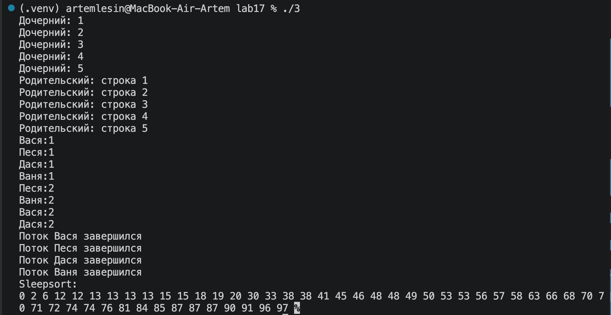
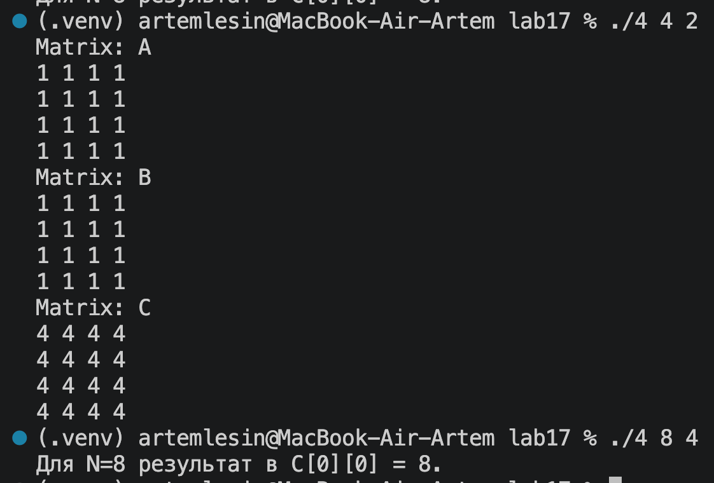
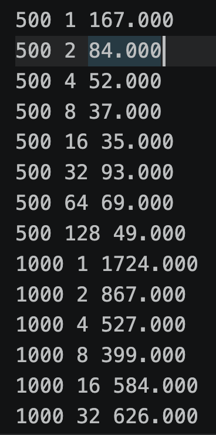
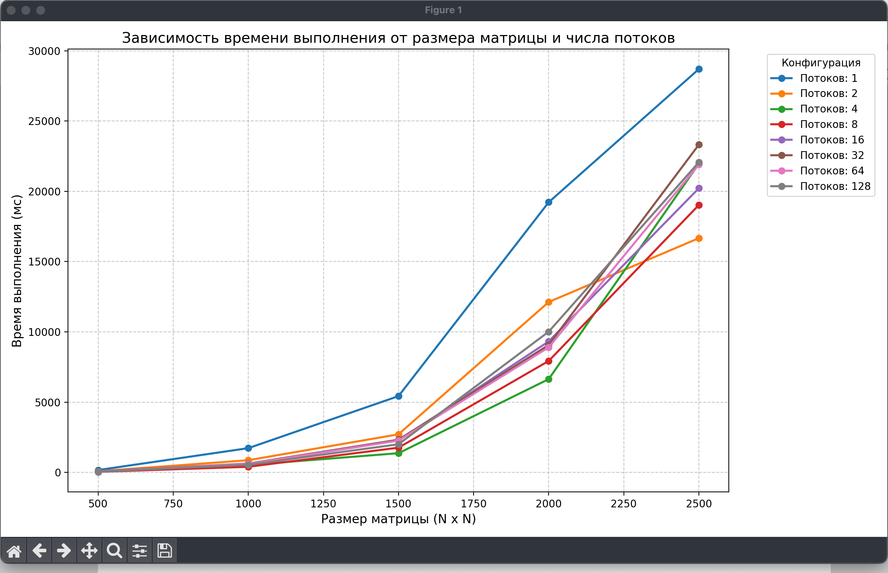

# Лабораторная работа: Управление потоками (pthreads)

## Оценка 3(исходный код 3.c). Знакомство с pthread:
### 1. Создать поток 
#### Написать программу, которая создает поток с помощью pthread_create(). Использовать атрибуты по умолчанию.  Родительский и дочерний потоки должны вывести на экран по 5 строк текста. 
```cpp
#include <stdio.h>
#include <pthread.h>
void* daughter_pt(void* five) {
    for (int i = 1; i <= 5; i++) {
        printf("Дочерний: %d\n", i);
    }
    return NULL;
}
int main() {
    pthread_t text;
    pthread_create(&text, NULL, daughter_pt, NULL);     
    for (int i = 1; i <= 5; i++) {
        printf("Родительский: строка %d\n", i);
    }
}
```
### 2. Ожидание потока
#### Модифицировать упр.1 так, что родительский поток выводит текст после завершения дочернего потока. Добавляем pthread_join() перед выводом родительского потока
```cpp
#include <stdio.h>
#include <pthread.h>
void* daughter_pt(void* five) {
    for (int i = 1; i <= 5; i++) {
        printf("Дочерний: %d\n", i);
    }
    return NULL;
}
int main() {
    pthread_t text;
    pthread_create(&text, NULL, daughter_pt, NULL);
    pthread_join(text, NULL);     
    for (int i = 1; i <= 5; i++) {
        printf("Родительский: строка %d\n", i);
    }
}
```
### 3. Параметры потока
#### Модифицировать упр.2 так, что основной поток создает 4 потока, исполняющих одну и ту же функцию. Эта функция должна распечатать последовательность текстовых строк, переданных как параметр. Каждый из созданных потоков должен распечатать различные последовательности строк.

```cpp
void* print(void* name){
    for (int i=0; i<5;i++){
        printf("%s:%d\n", (char*)name,i+1);
    }
    return NULL;
}
int main() {
    pthread_t text1,text2,text3,text4;
    char a[]="Вася";
    char b[]="Песя";
    char c[]="Дася";
    char d[]="Ваня";

    pthread_create(&text1,NULL,&print,a);
    pthread_create(&text2,NULL,&print,b);
    pthread_create(&text3,NULL,&print,c);
    pthread_create(&text4,NULL,&print,d);

    pthread_join(text1, NULL);
    pthread_join(text2, NULL);
    pthread_join(text3, NULL);
    pthread_join(text4, NULL);
}
```
### 4. Завершение нити без ожидания
#### Добавить сон с помощью sleep() в функцию потоков между выводами строк. Спустя две секунды после создания дочерних потоков основной поток должен прервать работу всех дочерних потоков с помощью pthread_cancel(). 
```cpp
#include <stdio.h>
#include <pthread.h>
#include <time.h>

void* daughter_pt(void* five) {
    for (int i = 1; i <= 5; i++) {
        printf("Дочерний: %d\n", i);
        sleep(1);
    }
    return NULL;
}

void* print(void* name){
    for (int i=0; i<5;i++){
        printf("%s:%d\n", (char*)name,i+1);
        sleep(1);
    }
    return NULL;
}

int main() {
    srand(time(NULL));
    pthread_t text;
    pthread_create(&text, NULL, daughter_pt, NULL); 
    pthread_join(text, NULL);
    
    for (int i = 1; i <= 5; i++) {
        printf("Родительский: строка %d\n", i);
    }
    pthread_t text1,text2,text3,text4;
    char a[]="Вася";
    char b[]="Песя";
    char c[]="Дася";
    char d[]="Ваня";

    pthread_create(&text1,NULL,&print,a);
    pthread_create(&text2,NULL,&print,b);
    pthread_create(&text3,NULL,&print,c);
    pthread_create(&text4,NULL,&print,d);
    
    sleep(2);
    pthread_cancel(text1);
    pthread_cancel(text2);
    pthread_cancel(text3);
    pthread_cancel(text4);
    
    pthread_join(text1, NULL);
    pthread_join(text2, NULL);
    pthread_join(text3, NULL);
    pthread_join(text4, NULL);
}
```
### 5. Обработать завершение потока
#### Модифицировать упр. 4 так, чтобы дочерний поток перед завершение распечатывал сообщение об этом. Использовать pthread_cleanup_push()
```cpp
void goodbye(void *name){
    printf("Поток %s завершился\n",(char*)name);
}
void* print(void* name){
    pthread_cleanup_push(goodbye, name);
    for (int i=0; i<5;i++){
        printf("%s:%d\n", (char*)name,i+1);
        sleep(1);
    }
    pthread_cleanup_pop(1); 
    return NULL;
}
```

### 6. Реализовать простой Sleepsort

```cpp
void* sleep_sort(void* numb){
    int val = *(int*)numb;
    usleep(val*10000);
    printf("%d ",val);

    return NULL;
}
int main() {
    int arr[50];
    pthread_t pthread[50];
    for (int i =0;i<50;i++){
        arr[i]=rand()%100;
        pthread_create(&pthread[i], NULL, sleep_sort, &arr[i]);    
    }
    for (int i = 0; i < 50; i++) {
        pthread_join(pthread[i], NULL);
    }
}
```

## Оценка 4(исходный код 4_1.c). Перемножение матриц:
### 7. Синхронизированный вывод
#### Модифицируйте программу упр. 5 так, чтобы вывод родительского и дочернего потока был синхронизован: сначала родительский поток выводить первую строку, затем дочерний, затем родительский вторую строку и т.д. Использовать mutex.

```cpp
pthread_mutex_t m = PTHREAD_MUTEX_INITIALIZER;
pthread_cond_t cond = PTHREAD_COND_INITIALIZER;
int turn = 0;

void* daughter_pt(void* arg) {
    for (int i=1; i<=5; i++) {
        pthread_mutex_lock(&m);
        while (turn!=1) { 
            pthread_cond_wait(&cond, &m);
        }
        printf("Дочерний поток: %d\n", i);
        turn = 0;
        pthread_cond_signal(&cond);
        pthread_mutex_unlock(&m);
    }
    return NULL;
}
int main() {
    pthread_t text;
    pthread_create(&text, NULL, daughter_pt, NULL);

    for (int i=1; i<=5; i++) {
        pthread_mutex_lock(&m);   
        while (turn != 0) { 
            pthread_cond_wait(&cond, &m);
        }
        printf("Родительский поток: строка %d\n", i);
        turn =1; 
        pthread_cond_signal(&cond);
        pthread_mutex_unlock(&m);
    }
}
```
### 8. Перемножение квадратных матриц NxN(a)
#### Написать функцию произведения двух квадратных матриц A и B размером NxN
```cpp
void Matrix(int n, int **A,int **B,int **C){
    for (int i=0;i<n;i++){
        for (int j=0;j<n;j++){
            C[i][j]=0;
            for (int k=0;k<n;k++){
                C[i][j]+=A[i][k]*B[k][i];
            }
        }
    }
}
void printMatrix(int n, int **matrix,char *name){
    printf("Matrix: %s\n",name);
    for (int i=0;i<n;i++){
        for (int j=0;j<n;j++){
            printf("%d",matrix[i][j]);
        }
        printf("\n");
    }
}
int main() {
    int n;
    printf("Input: N\n");
    scanf("%d",&n);
    int **A = malloc(n * sizeof(int *));
    int **B = malloc(n * sizeof(int *));
    int **C = malloc(n * sizeof(int *));
    for (int i=0;i<n;i++){
        A[i]=malloc(n * sizeof(int));
        B[i]=malloc(n * sizeof(int));
        C[i]=malloc(n * sizeof(int));
    }
    for (int i=0;i<n;i++){
        for (int j=0;j<n;j++){
            A[i][j]=1;
            B[i][j]=1;
        }
    }
    Matrix(n,A,B,C);
    if (n < 5) {
        printMatrix(n, A, "A");
        printMatrix(n, B, "B");
        printMatrix(n, C, "C");
    } else {
        printf("Для N=%d результат в каждой ячейке C будет равен %d.\n", n, n);
    }
}
```
### 8. Перемножение квадратных матриц NxN(b)(исходный код 4_b.c)
#### С командной строки считать размер матрицы и количество потоков. Распараллелить перемножение матриц разбив матрицу на равные части между потоками
```cpp
#include <stdio.h>
#include <stdlib.h>
#include <pthread.h>

typedef struct {
    int start_row;
    int end_row;
    int n;
    int **A;
    int **B;
    int **C;
} Thread;

void* multiply_part(void* arg) {
    Thread* data = arg;
    for (int i = data->start_row; i < data->end_row; i++) {
        for (int j = 0; j < data->n; j++) {
            data->C[i][j] = 0;
            for (int k = 0; k < data->n; k++) {
                data->C[i][j] += data->A[i][k] * data->B[k][j];
            }
        }
    }
    return NULL;
}

void printMatrix(int n, int **matrix, char *name) {
    printf("Matrix: %s\n", name);
    for (int i = 0; i < n; i++) {
        for (int j = 0; j < n; j++) {
            printf("%d ", matrix[i][j]);
        }
        printf("\n");
    }
}

int main(int argc, char *argv[]) {
    int n = atoi(argv[1]);
    int count_thread = atoi(argv[2]);

    int **A = malloc(n * sizeof(int *));
    int **B = malloc(n * sizeof(int *));
    int **C = malloc(n * sizeof(int *));
    for (int i = 0; i < n; i++) {
        A[i] = malloc(n * sizeof(int));
        B[i] = malloc(n * sizeof(int));
        C[i] = malloc(n * sizeof(int));
        for (int j = 0; j < n; j++) {
            A[i][j] = 1; 
            B[i][j] = 1;
        }
    }

    pthread_t threads[count_thread];
    Thread thread_data[count_thread];
    int rows = n / count_thread;

    for (int i = 0; i < count_thread; i++) {
        thread_data[i].n = n;
        thread_data[i].A = A;
        thread_data[i].B = B;
        thread_data[i].C = C;
        thread_data[i].start_row = i * rows;
        thread_data[i].end_row = (i + 1) * rows; 
        pthread_create(&threads[i], NULL, multiply_part, &thread_data[i]);
    }

    for (int i = 0; i < count_thread; i++) {
        pthread_join(threads[i], NULL);
    }

    if (n < 5) {
        printMatrix(n, A, "A");
        printMatrix(n, B, "B");
        printMatrix(n, C, "C");
    } else {
        printf("Готово! Для N=%d результат в C[0][0] = %d.\n", n, C[0][0]);
    }
}
```

### 9. Время выполнения
#### Замерить время выполнения с момента создания потоков (до цикла с pthread_create) и до завершения работы потоков (после цикла pthread_join).
изменим только main
```cpp
#include <time.h>

int main(int argc, char *argv[]) {
    int n = atoi(argv[1]);
    int count_thread = atoi(argv[2]);

    struct timespec start, end;
    clock_gettime(CLOCK_MONOTONIC, &start); 

    int **A = malloc(n * sizeof(int *));
    int **B = malloc(n * sizeof(int *));
    int **C = malloc(n * sizeof(int *));
    for (int i = 0; i < n; i++) {
        A[i] = malloc(n * sizeof(int));
        B[i] = malloc(n * sizeof(int));
        C[i] = malloc(n * sizeof(int));
        for (int j = 0; j < n; j++) {
            A[i][j] = 1; 
            B[i][j] = 1;
        }
    }

    pthread_t threads[count_thread];
    Thread thread_data[count_thread];
    int rows = n / count_thread;

    for (int i = 0; i < count_thread; i++) {
        thread_data[i].n = n;
        thread_data[i].A = A;
        thread_data[i].B = B;
        thread_data[i].C = C;
        thread_data[i].start_row = i * rows;
        thread_data[i].end_row = (i + 1) * rows; 
        
        pthread_create(&threads[i], NULL, multiply_part, &thread_data[i]);
    }

    for (int i = 0; i < count_thread; i++) {
        pthread_join(threads[i], NULL);
    }
    clock_gettime(CLOCK_MONOTONIC, &end);
    float time = (end.tv_sec - start.tv_sec) * 1000; 
    time += (end.tv_nsec - start.tv_nsec) / 1000000; 
   
    FILE *f = fopen("data.txt", "a"); 
    fprintf(f, "%d %d %.3f\n", n, count_thread, time);
    fclose(f);

    if (n < 5) {
        printMatrix(n, A, "A");
        printMatrix(n, B, "B");
        printMatrix(n, C, "C");
    } else {
        printf("Готово! Для N=%d результат в C[0][0] = %d.\n", n, C[0][0]);
    }
}
```
#### (run.sh)скрипт для сбора данных в data.txt
```bash
gcc -O3 4_c.c -o prog -lpthread
rm -f data.txt
for n in 500 1000 1500 2000 2500
do
    for t in 1 2 4 8 16 32 64 128
    do
        echo "Запуск: N=$n, Потоков=$t"
        ./prog $n $t
    done
done
```

#### отрисовка графика на Python(graph.py)
```python
import matplotlib.pyplot as plt
results = {}

with open("data.txt", "r") as f:
    for line in f:
        n, t, time_ms = line.split()
        n, t, time_ms = int(n), int(t), float(time_ms)
        
        if t not in results:
            results[t] = []
        results[t].append([n, time_ms])

plt.figure(figsize=(10, 6))
for t in sorted(results.keys()):
    data = sorted(results[t]) 
    plt.plot([r[0] for r in data], [r[1] for r in data], marker='o', label=f'{t} потоков')

plt.legend()
plt.grid(True)
plt.savefig('graph.png')
plt.show()
```
#### Вывод графика:



